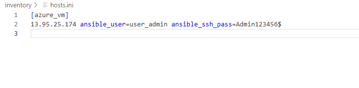
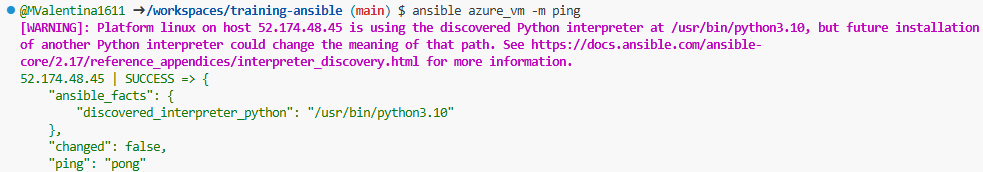

# 📄 Informe de Práctica de Aprovisionamiento con Ansible

## 🌐 Descripción General

En esta práctica se realizó el aprovisionamiento de una máquina virtual en **Azure** utilizando **Terraform** y la posterior configuración y despliegue de servicios con **Ansible**. El objetivo era desplegar una aplicación basada en Docker, concretamente el juego de **Super Mario Bros**, en una máquina virtual con **Ubuntu**, accediendo a la aplicación a través de un navegador web.

Se utilizaron las siguientes tecnologías: 
- ⚙️ **Terraform** para crear la infraestructura en Azure.
- 🛠️ **Ansible** para la configuración y gestión de la VM.
- 🐳 **Docker** para el despliegue de la aplicación.

## 🔧 Pasos Realizados

### 1️⃣ Aprovisionamiento de Infraestructura con Terraform
El aprovisionamiento de la máquina virtual en Azure se realizó utilizando **Terraform**. Las configuraciones principales incluyeron la creación de:
- Grupo de recursos
- Red virtual
- Subred
- Interfaz de red
- Dirección IP pública

La imagen de **Ubuntu** utilizada inicialmente fue:

```hcl
source_image_reference {
  publisher = "Canonical"
  offer     = "UbuntuServer"
  sku       = "18.04-LTS"
  version   = "latest"
}
```

### 2️⃣ Despliegue de Contenedor Docker con Ansible
Luego del aprovisionamiento de la infraestructura, se utilizó **Ansible** para desplegar un contenedor **Docker** que ejecuta el juego de **Super Mario Bros**. El `playbook` incluyó la instalación de Docker y la ejecución del contenedor.

El contenedor Docker desplegado utilizaba la imagen:

```
pengbai/docker-supermario:latest
```

Este contenedor expone el puerto `8080`, que se mapeó al puerto `8787` de la máquina virtual para permitir el acceso desde un navegador.

Se siguieron los siguientes pasos:
1. **Agregar la información del host (vm)**: 
 
2. **Verificando la conexión**: 
   ```bash
   ansible azure_vm -m ping
   ```
      

3. **Ejecutar el playbook de instalación de Docker**: 
   ```bash
   ansible-playbook playbooks/install_docker.yml
   ```

4. **Ejecutar el playbook para el contenedor de Super Mario**: 
   ```bash
   ansible-playbook playbooks/run_container.yml
   ```
   

   
### 3️⃣ Configuración de Seguridad en Azure
Para permitir el acceso a la aplicación, se creó una **regla de seguridad** en Azure que habilitaba el tráfico entrante al puerto `8787`. Aquí está la configuración de la regla:

```hcl
resource "azurerm_network_security_rule" "allow_http_8787" {
  name                       = "AllowHTTP8787"
  priority                   = 1001
  direction                  = "Inbound"
  access                     = "Allow"
  protocol                   = "Tcp"
  source_port_range          = "*"
  destination_port_range     = "8787"
  source_address_prefix      = "*"
  destination_address_prefix = "*"
  resource_group_name        = azurerm_resource_group.rg.name
  network_security_group_name = azurerm_network_security_group.nsg.name
}
```

Esta regla permitió el acceso al puerto `8787`, vinculado al puerto `8080` del contenedor **Docker**.

## ❗ Inconvenientes y Soluciones

### ⚠️ 1. Problema con la Versión de Python
Al ejecutar el `playbook` de Ansible, surgió un problema con la versión de **Python** en la máquina virtual, ya que **Python 3.6** no era compatible con ciertos módulos. El error se solucionó cambiando la imagen de Ubuntu a una versión más reciente:

```hcl
source_image_reference {
  publisher = "Canonical"
  offer     = "0001-com-ubuntu-server-jammy"
  sku       = "22_04-lts"
  version   = "latest"
}
```

Al cambiar a esta imagen de **Ubuntu 22.04**, el problema fue resuelto y el `playbook` se ejecutó correctamente. ✅

### ⚠️ 2. Configuración de Regla de Seguridad para el Puerto 8787
Inicialmente, no se configuró una regla de seguridad para el puerto `8787`, lo que impidió el acceso al juego **Super Mario Bros**. Esto se resolvió agregando la regla de seguridad mencionada anteriormente, permitiendo el acceso al puerto desde el navegador. 🌐

### Evidencia del despliegue
 

## ✅ Conclusión

La práctica fue exitosa, logrando el aprovisionamiento de una máquina virtual en **Azure**, la instalación de **Docker** y el despliegue del contenedor con **Super Mario Bros**. Se solucionaron problemas relacionados con la versión de **Python** y la configuración de reglas de seguridad en **Azure**.

El uso de **Terraform** para la creación de la infraestructura y **Ansible** para la gestión de la máquina virtual simplificó el proceso de despliegue, mostrando la eficiencia de estas herramientas para aprovisionamiento automatizado y gestión de configuraciones.

## 📚 Referencias
- [Terraform Documentation](https://www.terraform.io/docs)
- [Ansible Documentation](https://docs.ansible.com/)
- [Docker Documentation](https://docs.docker.com/)
